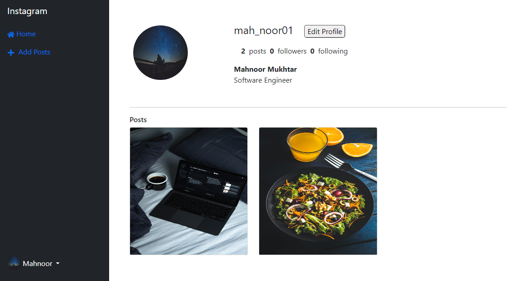

# Instagram Clone Frontend

This is the frontend of the Instagram clone project, built using React.

[backend](https://github.com/MahnoorMukhtar/instagram_clone_backend_django.git) for this project in django and django Rest framework.

## Table of Contents

- [Overview](#overview)
- [Features](#features)
- [Prerequisites](#prerequisites)
- [Installation](#installation)
- [Usage](#usage)
- [Technologies Used](#technologies-used)
- [Screenshots](#screenshots)

## Overview

This project is an Instagram clone that replicates some of the basic features of the popular photo-sharing platform. It consists of a frontend built with React and a backend implemented with Django.

## Features

- User authentication (signup, login, logout)
- Image uploading and sharing
- Like and comment on posts
- View other user's posts on main page
- View other user's profile
- Edit your own profile
- Delete your own Posts

## Prerequisites

Before you begin, ensure you have met the following requirements:

- Node.js and npm installed
- Backend server (Django server) running and accessible

## Installation

To run the project locally, follow these steps:

`npm install`
`npm start`

## Usage 
- Open your browser and go to `http://localhost:3000` to access the React frontend.
- The Django backend will be running at `http://localhost:8000`.

## Technologies Used

- ReactJs
- Redux for state management
- JWT Authentication with Django
- React Router
- Axios for API communication

## Screenshots
Welcome page

LoggedIn User Profile

